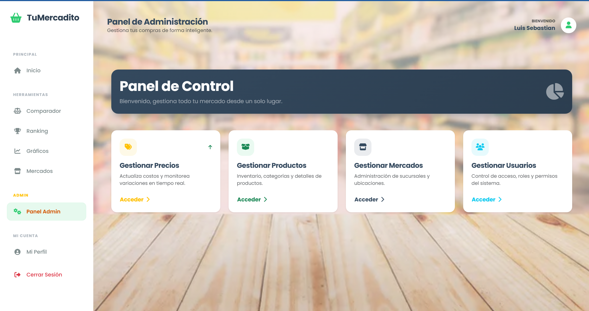
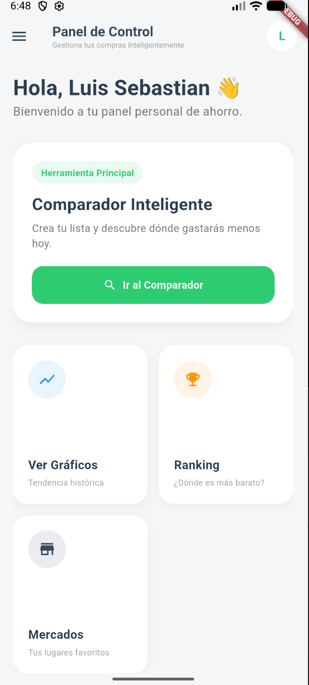

# 🛒 TuMercadito - Sistema Inteligente de Comparación de Precios

**TuMercadito** es una solución integral (Web + Móvil) diseñada para ayudar a los usuarios a encontrar los mejores precios de la canasta básica en diferentes mercados locales. El sistema permite monitorear tendencias, comparar costos en tiempo real y gestionar la información a través de un panel administrativo.

---

## 📸 Capturas de Pantalla

| Panel Web (Admin) | App Móvil (Usuario) |
|:---:|:---:|
|  |  |
| *Gestión de productos y precios* | *Comparador y Ranking* |


---

## 🚀 Tecnologías Utilizadas

### 🌐 Backend & Web (Panel Administrativo)
* **Lenguaje:** PHP 8 (Arquitectura MVC Nativa).
* **Base de Datos:** MySQL (Relacional).
* **Frontend Web:** HTML5, CSS3, JavaScript.
* **Framework CSS:** Bootstrap 5 (Diseño Responsivo).
* **API:** RESTful API personalizada (JSON) para comunicación con la App.

### 📱 Aplicación Móvil
* **Framework:** Flutter (Dart).
* **Gestión de Estado:** `setState` (Arquitectura limpia).
* **Conectividad:** Paquete `http`.
* **Gráficos:** Paquete `fl_chart` para visualización de datos y predicciones.
* **Diseño:** Material Design 3.

### 🛠 Herramientas de Desarrollo
* **Servidor Local:** XAMPP (Apache/MySQL).
* **Túnel de Red:** Ngrok (Para exponer el localhost a dispositivos móviles).
* **IDE:** Visual Studio Code.

---

## ✨ Funcionalidades Principales

### 🖥️ Módulo Web (Administrador)
1.  **Dashboard Interactivo:** Vista general del estado del sistema.
2.  **CRUD de Productos:** Gestión de inventario, categorías y unidades de medida.
3.  **Gestión de Mercados:** Administración de sucursales y ubicaciones.
4.  **Actualización de Precios:** Interfaz rápida para actualizar costos por mercado.
5.  **Control de Usuarios:** Gestión de roles (Admin/Usuario) y accesos.

### 📱 Módulo Móvil (Cliente)
1.  **Comparador de Canasta:** El usuario arma una lista y la app calcula dónde es más barato comprar el total.
2.  **Ranking de Precios:** Muestra qué mercado tiene el mejor precio para un producto específico (Top #1, #2...).
3.  **Historial y Gráficos:** Visualización de la tendencia de precios con predicción lineal simple.
4.  **Gestión de Perfil:** Edición de datos y cambio de contraseña seguro.
5.  **Mercados Favoritos:** Lista de establecimientos preferidos.

---

## ⚙️ Instalación y Configuración

### 1. Base de Datos
1.  Abre **phpMyAdmin** (XAMPP).
2.  Crea una base de datos llamada `tumercadito`.
3.  Importa el archivo `database.sql` (ubicado en la carpeta `/docs` o raíz).

### 2. Configuración Web (Backend)
1.  Clona el repositorio en tu carpeta `htdocs` de XAMPP:
    ```bash
    git clone [https://github.com/TU_USUARIO/TuMercadito.git](https://github.com/TU_USUARIO/TuMercadito.git)
    ```
2.  Configura la conexión en `app/config/config.php`:
    ```php
    define('DB_HOST', 'localhost');
    define('DB_USER', 'root');
    define('DB_PASS', '');
    define('DB_NAME', 'tumercadito');
    ```
3.  Accede desde el navegador: `http://localhost/TuMercadito`

### 3. Configuración Móvil (Flutter)
1.  Navega a la carpeta del proyecto móvil.
2.  Instala las dependencias:
    ```bash
    flutter pub get
    ```
3.  Configura la URL de la API en `lib/services/api_service.dart`.
    * **Modo Local (Emulador):** `http://10.0.2.2/TuMercadito/Api`
    * **Modo Dispositivo Físico (Ngrok):** `https://tu-id-ngrok.ngrok-free.app/TuMercadito/Api`
    * **Modo Producción:** `http://tu-dominio.com/TuMercadito/Api`
4.  Ejecuta la aplicación:
    ```bash
    flutter run
    ```

---

## 📡 Uso con Ngrok (Pruebas en Dispositivo Físico)
Dado que la API está en local (XAMPP), para probar en un celular real se utiliza **Ngrok**:

1.  Iniciar servidor Apache/MySQL en XAMPP.
2.  Ejecutar Ngrok en la terminal:
    ```bash
    ngrok http 80
    ```
3.  Copiar la URL `https` generada.
4.  Pegarla en `api_service.dart` (`baseUrl`).
5.  Generar APK o correr en modo debug.

---

## 🤝 Contribución
Este proyecto fue desarrollado con fines educativos y de portafolio. ¡Cualquier sugerencia es bienvenida!

1.  Fork el proyecto.
2.  Crea una rama (`git checkout -b feature/AmazingFeature`).
3.  Commit tus cambios (`git commit -m 'Add some AmazingFeature'`).
4.  Push a la rama (`git push origin feature/AmazingFeature`).
5.  Abre un Pull Request.

---

**Desarrollado con ❤️ por [Tu Nombre]**
